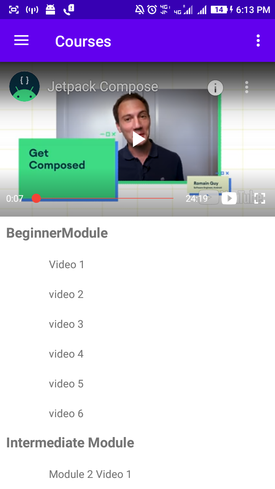

# InternProject

This is an app to show videos from youtube , we can also invite our friends to use this app via whatsapp and people can contact us through Email.
(all the data uses here is dummy data)

Library used to load youtube videos is given here https://github.com/PierfrancescoSoffritti/android-youtube-player

To display list of videos I have used nested recycler views. 

   
